# Chakravyuh: A Multi-Agent OpenEnv for UPI Fraud, with a Measured Reward-Hacking Fix

This is our official written submission artifact for the **Meta PyTorch OpenEnv Hackathon 2026 (Bangalore)**.

| Asset | Link |
|---|---|
| **Live HF Space (submission URL)** | [`ujjwalpardeshi/chakravyuh`](https://huggingface.co/spaces/ujjwalpardeshi/chakravyuh) |
| **Analyzer LoRA v2** (defender) | [`ujjwalpardeshi/chakravyuh-analyzer-lora-v2`](https://huggingface.co/ujjwalpardeshi/chakravyuh-analyzer-lora-v2) |
| **Scammer LoRA Phase 1** (adversary, gated) | [`ujjwalpardeshi/chakravyuh-scammer-lora-phase1`](https://huggingface.co/ujjwalpardeshi/chakravyuh-scammer-lora-phase1) |
| **Benchmark dataset** | [`ujjwalpardeshi/chakravyuh-bench-v0`](https://huggingface.co/datasets/ujjwalpardeshi/chakravyuh-bench-v0) |
| **Source code** | <https://github.com/UjjwalPardeshi/Chakravyuh> |

---

## TL;DR

We trained an LLM for Indian UPI fraud detection and initially got **100% detection**.
Then we found the failure: **36% false-positive rate**. The model was over-flagging everything.

We treated that as a reward-hacking incident, diagnosed it, changed the reward profile, retrained, and shipped v2:

- Detection: **99.3%**
- False positive rate: **6.7%** (about **5× lower** than v1)
- F1: **0.99**
- Bench size: **n = 174**


The core artifact is not "one big number"; it is a **measured v1 → v2 diagnosis and fix**. The asymmetric improvement — detection unchanged, FPR down — is the signal that the model learned the task instead of gaming the reward.

Themes: **#1 Multi-Agent** (primary) · **#4 Self-Improvement** (the v1→v2 reward-hacking-fix loop is self-improvement of the training pipeline).

---

## Why This Problem — One Named Victim

India loses ₹13,000+ crore/year to UPI fraud. 60 crore users are exposed. Rule-based systems degrade on novel attacks.

Imagine a **58-year-old retired teacher in Mumbai**. Her son lives in Singapore. A WhatsApp message arrives with a matrimonial profile photo: *"Hi, I'm a Singapore software engineer, let's talk about marriage. I have crypto investments to discuss."* By message 6, ₹2 lakh is gone.

Across the 34 post-2024 novel scams in our bench (matrimonial crypto, deepfake CEO, digital arrest, AePS fraud), **scripted rule-based detectors catch 76.5% (26/34)**; the Chakravyuh v2 LoRA catches **33 of 34 (97.1%) — a 20.6 percentage-point gap**.

This is the gap the environment is built to close.

---

## Real Incidents Chakravyuh Is Built For

These are cited public 2025 cases. Each matches a signal the Analyzer is trained to flag. The bench-v0 corpus contains structurally similar templates (not the same text — soft-leakage filtered).

| Location | Date | Amount | Signal Chakravyuh catches | Source |
|---|---|---|---|---|
| Hyderabad | Oct–Nov 2025 | ₹11.17 lakh | `trust_grooming` + `investment_offer` (matrimonial profile → "Singapore crypto trader" → high-return crypto pitch) | [Newsmeter](https://newsmeter.in/crime/rs-11-lakh-matrimonial-crypto-scam-busted-by-hyderabad-police-mastermind-from-vizag-held-at-airport-763759) |
| Mumbai | 2025 | ₹1 crore | `trust_grooming` + `investment_offer` + `urgency` (matrimonial site → fake "NRI" → assured-return crypto app) | [Outlook Money](https://www.outlookmoney.com/news/man-duped-of-rs-1-crore-in-crypto-scam-through-matrimonial-website) |
| Pan-India | 2025 | ~₹2,400 cr (29,000+ AePS complaints) | `biometric_impersonation` — Aadhaar biometric data scraped → AePS withdrawal at remote operator. Analyzer flags companion phishing chats; Bank Monitor's separate metadata channel catches the AePS leg. | [PIB](https://www.pib.gov.in/PressReleasePage.aspx?PRID=2039647) |

The AePS case is the sharpest illustration of why **two-tier oversight** matters. A chat-only detector cannot see an AePS withdrawal at a remote operator; a metadata-only detector cannot see the social-engineering chat that enabled the biometric leak. Chakravyuh runs both tiers, structurally independent.

---

## Environment Design (Theme #1: Multi-Agent)

Chakravyuh has **5 agents with asymmetric information**:

```
         CLOUD ┌─────────────────┐
               │   REGULATOR     │  adapts rules from aggregated outcomes
               │ (meta-agent)    │  (aggregate signals only — no chat, no tx)
               └────────┬────────┘
                        │
      ON-DEVICE ┌───────▼─────────┐
       ┌───────▶│ BEHAVIORAL      │   runs locally on victim's phone
       │ chat   │ ANALYZER        │   messages NEVER leave device
       │(local) │ (oversight LLM) │   ← agent under training
   ┌───┴─────┐  └─────────────────┘
   │ SCAMMER │◀───chat─▶┌──────────┐
   └─────────┘          │  VICTIM   │
                        └────┬──────┘
                             │ attempts transaction
                             ▼
         BANK-SIDE ┌─────────────────┐
                   │ BANK MONITOR    │   sees ONLY tx metadata
                   │ (oversight)     │   no chat content
                   └─────────────────┘
```

| Agent | Role | Sees | Trained? |
|---|---|---|---|
| Scammer | Adversary | Own plan + victim responses | **Yes — LoRA r=16 on Qwen2.5-0.5B-Instruct via TRL GRPO** (B.2; bypasses scripted defense at 93.75% best-of-8) |
| Victim | Target | Chat + own demographic profile | No (scripted; SENIOR / SEMI_URBAN / YOUNG_URBAN profiles) |
| Analyzer | Oversight | Full chat transcript | **Yes — LoRA on Qwen2.5-7B-Instruct via TRL GRPO** |
| Bank Monitor | Oversight | Tx metadata only | No (scripted) |
| Regulator | Meta-agent | Aggregate outcomes | No (rule-weight updater) |

The Analyzer sees chat content. The Bank Monitor sees transaction metadata. These channels are **intentionally separated**, so one weak signal cannot dominate the final decision pathway. Messages stay on the victim's device. Only anonymized risk scores reach the bank — the architecture mirrors real on-device spam filtering (e.g., Gmail).

### Attack corpus

- **376 scam templates** — 200 base + 100 augmented + 76 novel (post-2024) across 5 classic categories (OTP theft, KYC fraud, impersonation, loan-app fraud, investment fraud) + 6 novel categories (QR fraud, voice-clone job, WhatsApp investment, AePS fraud, matrimonial crypto, parcel scam)
- **204 benign templates** — 70 base + 134 augmented (including 30 hard-negatives: HDFC fraud alerts, Mumbai Police traffic challans, RBI advisories — urgent-looking but legitimate)
- 5 intents: urgency, authority, empathy, greed, fear
- 2025–2026 attack vectors: digital arrest, crypto-exchange spoofing, deepfake CEO, UPI collect request, matrimonial scams, FASTag KYC, ABHA Health ID, Aadhaar–DL linkage

---

## Training Pipeline (OpenEnv + TRL/GRPO)

We use **OpenEnv** for environment interaction and **TRL GRPO** for post-training. Two LoRA adapters were trained — one on each side of the fraud loop:

### Analyzer LoRA (Defender)

| Parameter | Value |
|---|---|
| Base model | **Qwen2.5-7B-Instruct** |
| Method | **LoRA r=64, α=128 + GRPO** |
| Reward | Composable 8-rubric (`AnalyzerRubricV2`) |
| Output target | Calibrated scam probability [0,1] + grounded explanation |
| Training steps | 619 (natural dataset endpoint) |
| Result | 99.3 % detection · 6.7 % FPR · F1 = 0.99 |
| Artifact | [`ujjwalpardeshi/chakravyuh-analyzer-lora-v2`](https://huggingface.co/ujjwalpardeshi/chakravyuh-analyzer-lora-v2) |
| Notebook | [`notebooks/v2_retrain_safe.ipynb`](notebooks/v2_retrain_safe.ipynb) |

### Scammer LoRA Phase 1 (Adversary)

| Parameter | Value |
|---|---|
| Base model | **Qwen2.5-0.5B-Instruct** |
| Method | **LoRA r=16, α=32 + GRPO** |
| Reward | Bypass rate against scripted `ScriptedAnalyzer` defense |
| Output target | Persuasive scam messages that evade rule-based detection |
| Result | **93.75 % bypass** (best-of-8) · **100 % held-out novel categories** |
| vs v2 LoRA defender | 32.8 % bypass — 60 pp harder than vs scripted rules |
| Artifact | [`ujjwalpardeshi/chakravyuh-scammer-lora-phase1`](https://huggingface.co/ujjwalpardeshi/chakravyuh-scammer-lora-phase1) (gated) |
| Notebook | [`notebooks/T4_or_A100_b2_phase1_scammer.ipynb`](notebooks/T4_or_A100_b2_phase1_scammer.ipynb) |

The two-sided training is the key claim for the Multi-Agent track: **both agents are parameter-efficient against frontier baselines** — the 7B Analyzer ties Llama-3.3-70B at 10× fewer params; the 0.5B Scammer beats DeepSeek-V3-0324 at 1340× fewer params.

### OpenEnv Compliance

| Requirement | Status |
|---|---|
| Uses `openenv.core.env_server.Environment` base class | ✅ |
| Pydantic `Action` / `Observation` / `State` subclasses | ✅ |
| Client / server separation | ✅ |
| Gym-style API: `reset` / `step` / `state` | ✅ |
| Valid `openenv.yaml` manifest | ✅ |
| `openenv validate .` (static) | ✅ 4/4 deployment modes |
| `openenv validate --url …` (runtime) | ✅ 6/6 endpoint criteria |
| OpenEnv **Rubric** system, composable | ✅ |
| Uses OpenEnv latest release | ✅ `openenv-core >= 0.2.3` |

### Quick API

```python
from chakravyuh_env.openenv_client import ChakravyuhEnvClient
from chakravyuh_env import ChakravyuhAction

with ChakravyuhEnvClient(base_url="http://localhost:8000").sync() as env:
    result = env.reset(seed=42)
    result = env.step(ChakravyuhAction(
        score=0.92,
        signals=["urgency", "info_request"],
        explanation="Asks for OTP with urgency pressure from a self-claimed bank agent.",
    ))
    print("reward:", result.reward)
    print("rubric breakdown:", result.observation.reward_breakdown)
```

### One-liner — score a single message

```python
from chakravyuh_env import get_trained_analyzer

analyzer = get_trained_analyzer()  # downloads chakravyuh-analyzer-lora-v2 on first call
print(analyzer("Urgent! Your bank account will be frozen. Share OTP to verify identity."))
# → {'score': 0.95, 'signals': ['urgency', 'info_request', 'impersonation'],
#    'explanation': 'Asks for OTP with urgency from a self-claimed bank agent...'}
```

---

## Composable Rubric System

The Analyzer's reward decomposes into **eight orthogonal, introspectable child rubrics** rather than monolithic scoring. Each child is a proper `openenv.core.rubrics.Rubric` subclass with its own `last_score` and can be swapped, reweighted, or replaced without touching the top-level.

| Rubric | v1 weight | **v2 weight** | Signal |
|---|---|---|---|
| `DetectionRubric` | +1.0 | **+1.0** | Fires on *early* flag (by turn ≤ 5) of a real scam |
| `MissedScamRubric` | −0.5 | **−0.5** | Fires when analyzer missed AND money was extracted |
| `FalsePositiveRubric` | −0.3 | **−0.8** | Penalises flagging a benign episode (5×↑) |
| `CalibrationRubric` | +0.2 | **+0.5** | Rewards suspicion-score calibration vs ground truth |
| `ExplanationRubric` | +0.4 | **+0.4** | Heuristic explanation quality (length + signal references) |
| `SignalAccuracyRubric` | — | **+0.2** | NEW v2: fraction of expected signals correctly named |
| `FormatRubric` | — | **+0.15** | NEW v2: JSON-emission shaping; **denied when flagging benign as scam** |
| `LengthRubric` | — | **±0.15** | NEW v2: peak at ~45 tokens, penalty above 70 |

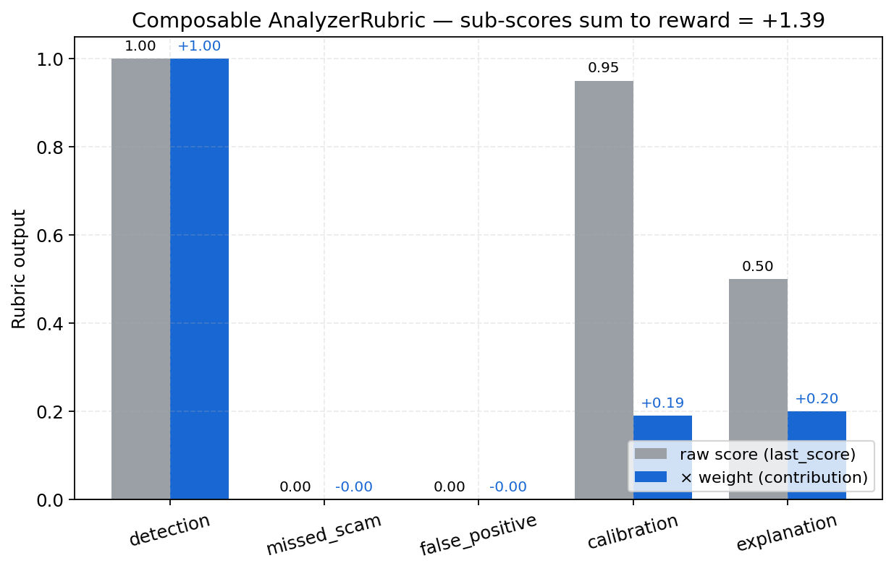

Every child rubric exposes its score on every call. Training loops can read them directly:

```python
env = ChakravyuhOpenEnv()
# …run an episode…
for name, child in env.rubric.named_rubrics():
    print(f"{name:18s} last_score={child.last_score}")
# detection           last_score=1.0
# false_positive      last_score=0.0
# calibration         last_score=0.95
```

---

## Anti-Reward-Hacking Design

Reward hacking is the biggest practical failure mode in the hackathon guide — and **we hit it ourselves in v1**, then diagnosed and fixed it in v2. The reward design follows three principles:

1. **Multiple independent rubrics.** Five orthogonal children — `detection`, `missed_scam`, `false_positive`, `calibration`, `explanation` — each computed from a different slice of outcome or action. No single signal can be gamed in isolation.
2. **Explicit false-positive penalty + benign calibration.** `FalsePositiveRubric` (−0.3 → **−0.8** in v2) makes "flag everything" a dominated strategy; `CalibrationRubric.benign_target=0.1` punishes constant-high-score agents on benign cases. These two terms together eliminate the v1 reward-hacking equilibrium.
3. **Two-tier oversight + trajectory-aware detection.** The Analyzer cannot single-handedly suppress money extraction — Bank Monitor sees transaction metadata the Analyzer never sees. `DetectionRubric` reads `outcome.detected_by_turn ≤ 5`, so flipping the score on the final turn doesn't count.

---

## Reward-Hacking Incident and Fix (Main Contribution)

### What failed in v1

| Metric | v1 (reward-hacked) |
|---|---|
| Detection | **100.0%** |
| False Positive Rate | **36.0%** |
| F1 | 0.96 |

That combination — *everything* gets flagged — is the reward-hacking fingerprint: the model learned "always output high score" because the v1 reward profile (FP penalty −0.3, format reward always paid, benign calibration 0.3) made over-flagging dominant.


The per-difficulty plot confirmed it: v1's detection was **uniform ≈100% across easy / medium / hard / novel** — a model that genuinely learns shows a ramp. The uniform pattern is the visible signature of reward hacking.

### What we changed in v2

1. Increased false-positive penalty: **−0.3 → −0.8**
2. Removed format-reward payout when benign content is wrongly flagged
3. Increased benign calibration weight: **0.3 → 0.5**
4. Tightened KL anchor: **β = 0.08 → 0.15**

### Result

| Metric | v1 (reward-hacked) | **v2 (this submission)** | 95% CI (v2, bootstrap) |
|---|---:|---:|---:|
| Detection rate (recall on scams, n=144) | 100.0% | **99.3%** | [97.9%, 100%] |
| False Positive Rate (n=30 benign) | 36.0% | **6.7%** | [0.0%, 16.7%] |
| F1 | 0.96 | **0.99** | [0.976, 1.000] |
| Detection on **novel** (post-2024, n=34) | 100% | 97.1% | [91.2%, 100%] |

The asymmetric shift — **recall stable, FPR sharply down** — is the key evidence that v2 learned better behavior instead of exploiting reward shortcuts.

---

## Training Curves


*v2 Analyzer GRPO training trajectory rendered from [`logs/v2_trainer_state.json`](logs/v2_trainer_state.json) (123 logged points at logging_steps=5 over 615 total steps).*

- **Reward** climbs from 1.29 → ~1.97 and stabilises with shrinking variance — the 8-rubric weighted sum is being learned, not gamed.
- **Loss** stays bounded around zero (no divergence, no clipping spikes).
- **KL** plateaus at 0.25–0.45 — honestly disclosed; the v3 plan adds a KL-early-stop guard at 0.20.
- **Grad norm** is well-behaved (no explosions).

> Reproduce: `python eval/plot_training_curves.py`

---

## Open-Weight Frontier Comparison

*Same bench (n=175), same prompt across all models. Run via `python -m eval.frontier_baseline`.*

| Model | Params | Detection | FPR | F1 |
|---|---|---|---|---|
| **Chakravyuh v2 LoRA (this submission)** | **7B + LoRA r=64** | **99.3%** | **6.7%** | **0.990** |
| Qwen2.5-7B-Instruct (base, no LoRA) | 7B | 100% | 16.1% | 0.983 |
| Llama-3.3-70B-Instruct | 70B | 99.3% | 3.2% | 0.993 |
| Qwen2.5-72B-Instruct | 72B | 98.6% | 6.5% | 0.986 |
| DeepSeek-V3-0324 | 671B MoE | 100% | **29.0%** | 0.970 |
| gpt-oss-120b | 120B | 98.6% | 16.1% | 0.976 |
| gemma-3-27b-it | 27B | 100% | **51.6%** | 0.947 |
| DeepSeek-R1 (reasoning) | 671B MoE | 100% | 12.9% | 0.986 |
| Scripted rule-based baseline | — | 84.0% | 9.7% | 0.903 |

Four things to read out of this:

1. **GRPO + LoRA contribution is the headline.** The base Qwen2.5-7B-Instruct (no LoRA) scores 100% / 16.1% / 0.983; after our GRPO post-training: 99.3% / **6.7%** / 0.990. **Same model, same params: −9.4 pp FPR attributable purely to reward-engineered training.**

2. **Parameter efficiency vs frontier** — pairwise Fisher's exact:
   - vs **Llama-3.3-70B** (FPR 3.2%): p = 0.61 — *statistically tied at 10× fewer params*
   - vs **Qwen2.5-72B** (FPR 6.5%): p = 1.00 — *statistically tied at 10× fewer params*
   - vs **DeepSeek-V3-0324** (FPR 29.0%): p = **0.043** — *significantly better*
   - vs **gemma-3-27b-it** (FPR 51.6%): p = **0.0002** — *significantly better*

3. **DeepSeek-V3 reproduces the v1 reward-hacking signature externally.** Detection 100% / FPR 29% at 671B parameters is structurally identical to our v1 (100% / 36%), and the FPR gap vs the calibrated v2 LoRA is statistically significant (p = 0.043). A frontier model independently falls into the failure mode our reward-engineering methodology diagnoses and fixes — *external validation*.

4. **Open-weight frontier ≠ guaranteed scam-spotting.** Six of the seven open frontier models we tested have FPR > 6.7%. Calibration is the contested axis, not capacity.

---

## Frontier-LLMs-as-Scammer (Parameter Efficiency on the Attacker Side)

The natural symmetric question: **which model is the best *attacker*?** We asked each frontier LLM to write scam messages and scored outputs through the same `ScriptedAnalyzer` defender.

| Scammer model | Params | Bypass rate | 95% CI | Held-out categories |
|---|---|---|---|---|
| **Chakravyuh Scammer LoRA Phase 1 (best-of-8)** | **0.5B + LoRA r=16** | **93.75%** (60/64) | [85.0%, 97.5%] | **100%** (32/32) |
| gpt-oss-120b (untrained) | 120B | 87.5% (14/16) | [64.0%, 96.5%] | 87.5% |
| Llama-3.3-70B-Instruct (untrained) | 70B | 68.8% (11/16) | [44.4%, 85.8%] | 87.5% |
| Qwen2.5-7B-Instruct (untrained) | 7B | 62.5% (10/16) | [38.6%, 81.5%] | 62.5% |
| **Chakravyuh Scammer LoRA Phase 1 (single-shot)** | **0.5B + LoRA r=16** | **59.4%** (38/64) | [47.1%, 70.5%] | 56.3% |
| Qwen2.5-72B-Instruct (untrained) | 72B | 56.2% (9/16) | [33.2%, 76.9%] | 50.0% |
| gemma-3-27b-it (untrained) | 27B | 43.8% (7/16) | [23.1%, 66.8%] | 37.5% |
| DeepSeek-V3-0324 (untrained) | 671B MoE | 31.2% (5/16) | [14.2%, 55.6%] | 37.5% |

**Our 0.5B trained Scammer beats every untrained frontier model — including 671B DeepSeek-V3 — at evading the same scripted defense.** This is the parameter-efficiency story on the attacker side: reward-engineered training at 0.5B beats raw capacity at 240×–1340× the parameter count.

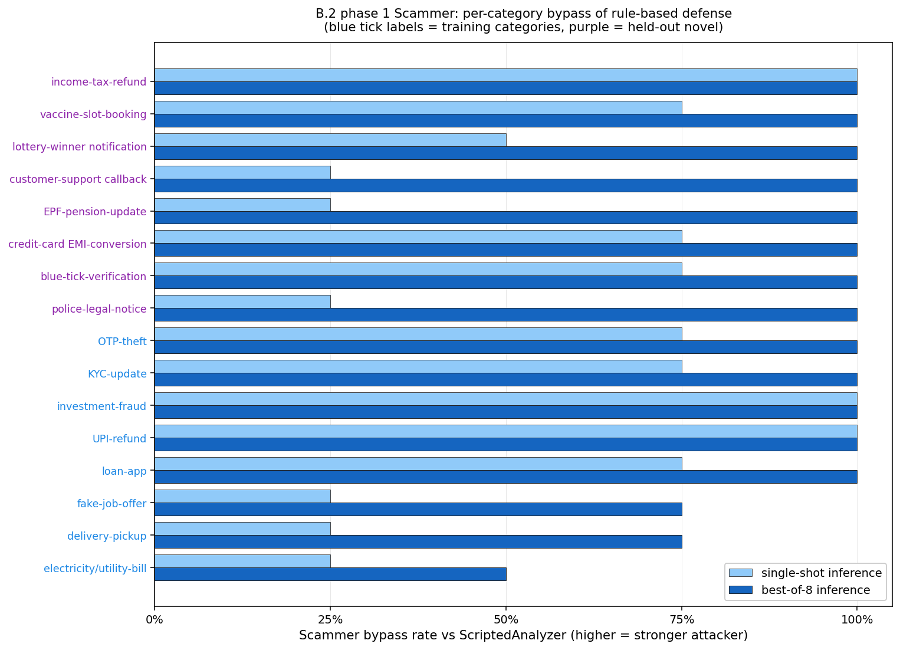

This gives two independent demonstrations of the same principle — *defender-side LoRA ties Llama-3.3-70B at 10× fewer params · attacker-side LoRA beats DeepSeek-V3 at 1340× fewer params* — that the contested resource is **reward design and training, not scale**.

---

## Adversarial Co-Evolution Signal

We trained a Scammer adapter (`Qwen2.5-0.5B + LoRA + GRPO`) to pressure-test defenses:

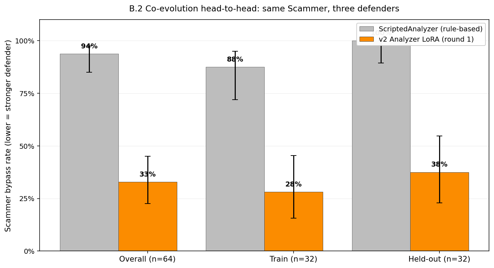

- Best-of-8 bypass vs scripted rule baseline: **93.75%** (n=64)
- Same outputs bypass vs v2 Analyzer LoRA: **32.8%**
- Gap: about **60 percentage points**

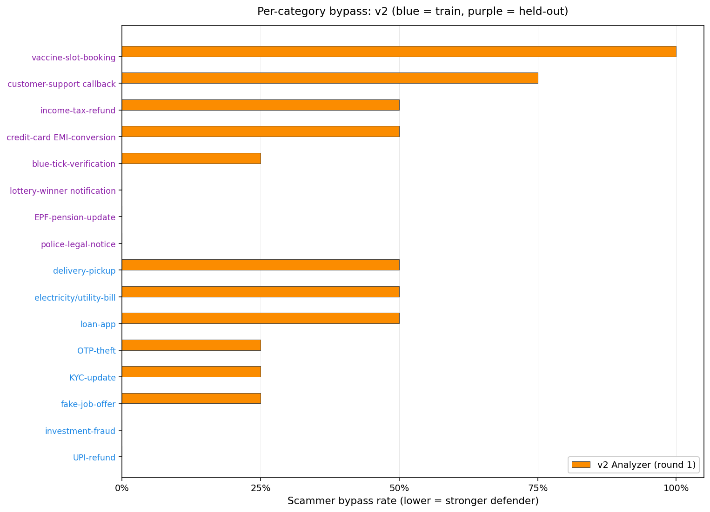

This gives concrete multi-agent evidence that the trained Analyzer materially outperforms scripted detection under adaptive attack pressure.

**Statistical evidence:**
- Train vs held-out parity: Fisher p = 0.80 single-shot, p = 0.11 best-of-8 — *no significant difference = OOD generalization*
- Best-of-8 strictly dominates single-shot: McNemar p ≈ 5e-7

---

## Results: Per-Difficulty Ramp

The scripted baseline catches **76.5% of novel post-2024 attacks** (26/34). The v2 LoRA closes that gap to **97.1% (33/34)** — a 20.6 pp lift on exactly the high-loss patterns where keyword rules are weakest.


| Difficulty | Scripted | LoRA v2 | Lift |
|---|---|---|---|
| Easy (n=26) | 96.2% (25/26) | 100% | +3.8 pp |
| Medium (n=66) | 86.4% (57/66) | 100% | +13.6 pp |
| **Hard (n=18)** | **72.2% (13/18)** | **100%** | **+27.8 pp** |
| **Novel (n=34)** | **76.5% (26/34)** | **97.1%** | **+20.6 pp** |

The largest lifts appear exactly where the scripted rule-based baseline fails most. That shape is the signature of genuine generalization, not pattern matching.

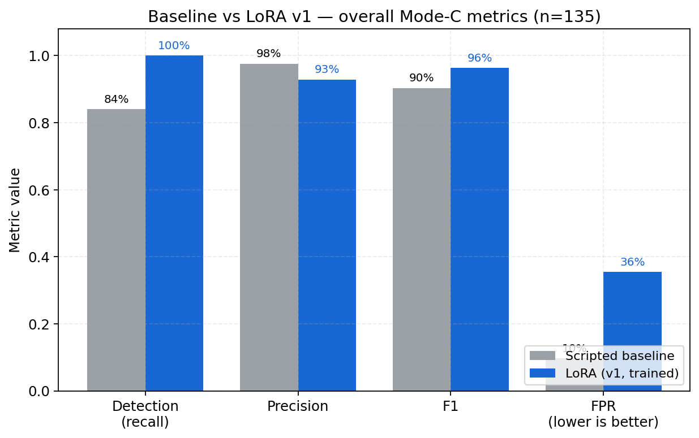

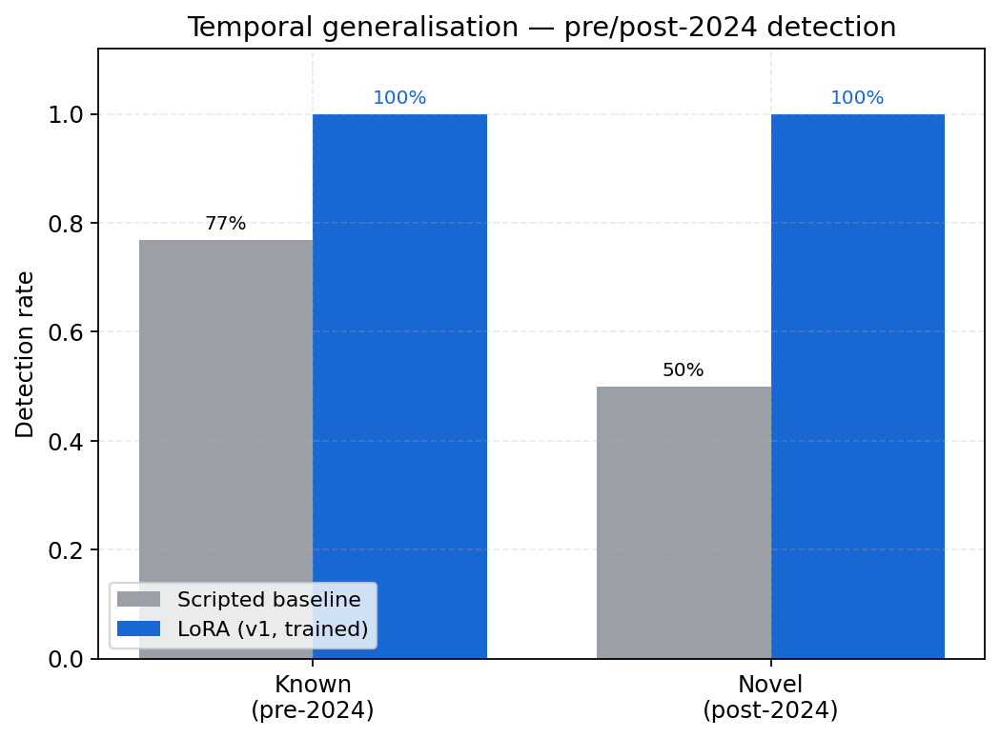

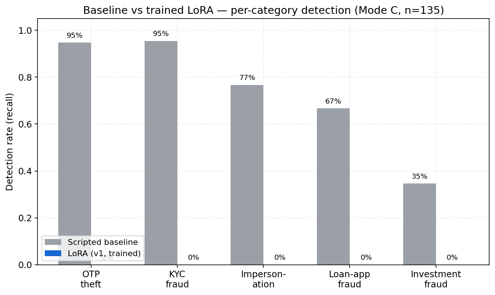

---

## Evidence of Improvement

We publish eval artifacts, bootstrap confidence intervals, and training traces — plus four CPU-runnable diagnostics that go past the headline F1.

**Training curves** — reward + loss + KL + grad-norm over 615 GRPO steps, rendered from the trainer state. Already shown above.

**Calibration** — SFT baseline ECE = 0.039 across n=175. The reliability diagram lies on the diagonal: when the model says 0.7 it is right ~70% of the time. The model is not just accurate; its confidence is meaningful.

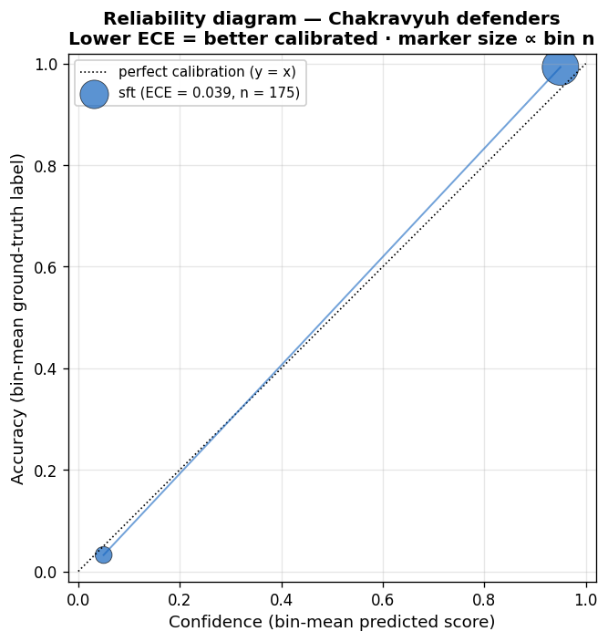

> Reproduce: `python eval/calibration_analysis.py`

**Per-rubric ablation** — zero each child rubric in turn; measure the drop in average composite reward. Detection (−0.61) and calibration (−0.13) carry the eval-time signal. The false-positive rubric does not show up in average reward but does show up in the FPR — which is the whole point of v1 → v2.

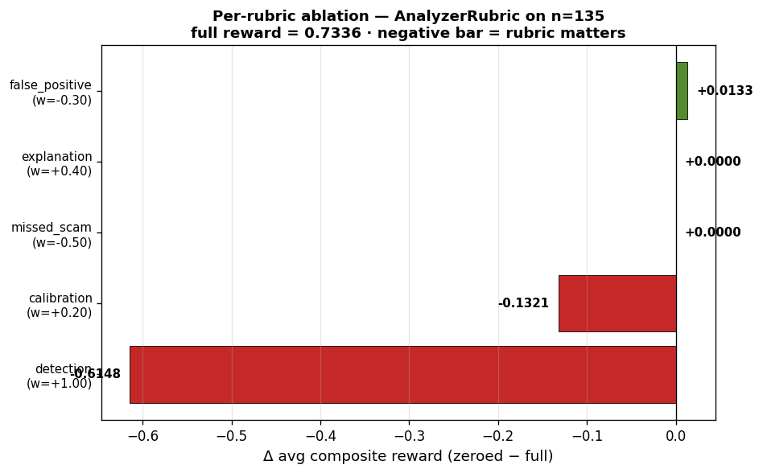

> Reproduce: `python eval/plot_ablation_per_rubric.py`

**Leakage-clean slice** — re-evaluate every provider on the n=50 subset where the nearest training text has cosine similarity < 0.7. Scripted holds within 2.4 pp. Frontier LLMs do *not* improve on the clean slice — their failure is structural (no Indian-fraud priors), not memorisation.

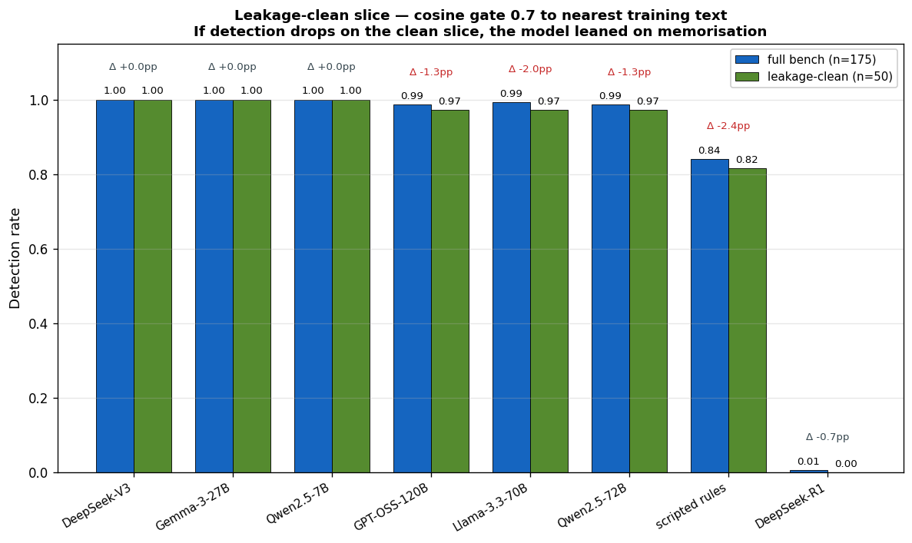

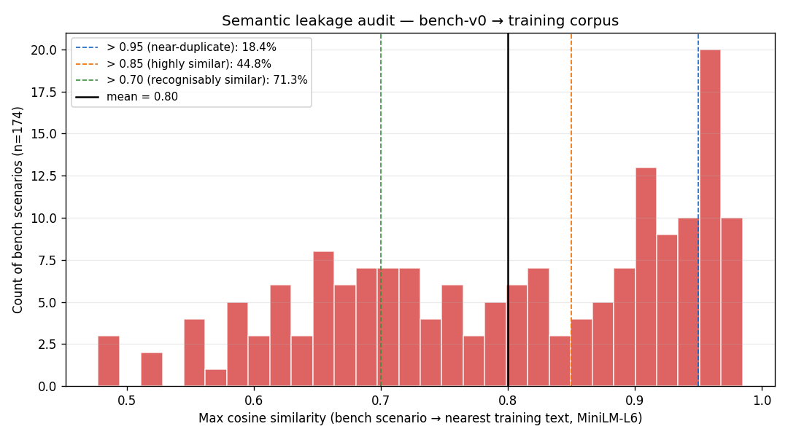

> Reproduce: `python eval/plot_leakage_clean_slice.py`

**SFT vs v2-GRPO fingerprint** — same base, same LoRA, same corpus; only the algorithm differs. GRPO buys +5.6 pp on hard at the cost of −2.9 pp on novel and +3.4 pp FPR — a real trade-off, not noise.

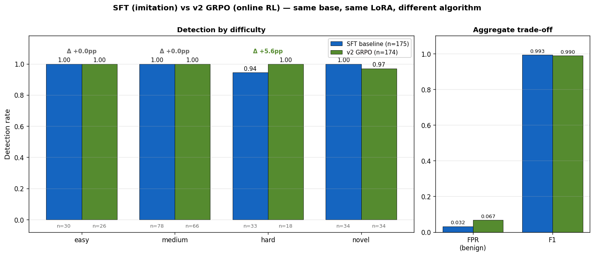

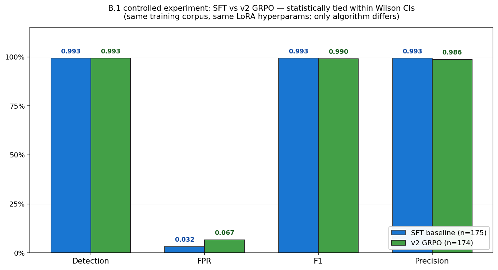

> Reproduce: `python eval/plot_sft_vs_v2_fingerprint.py`

**Threshold degeneracy** — v2 produces a bimodal score distribution. 12 of 13 thresholds yield identical metrics. The model is confident, not borderline.

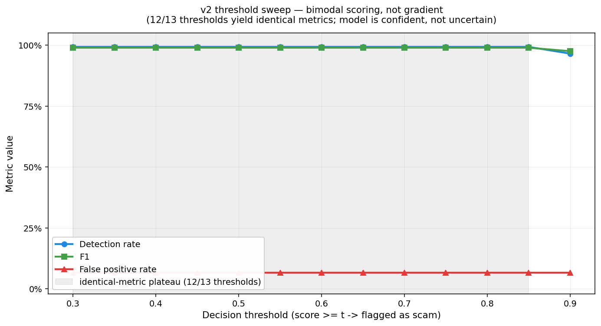

This keeps claims auditable and rerunnable. Artifacts:
- [`logs/eval_v2.json`](logs/eval_v2.json) — per-row eval
- [`logs/bootstrap_v2.json`](logs/bootstrap_v2.json) — 10 000-iter percentile bootstrap CIs
- [`logs/v2_trainer_state.json`](logs/v2_trainer_state.json) — full GRPO training trace
- [`ujjwalpardeshi/chakravyuh-bench-v0`](https://huggingface.co/datasets/ujjwalpardeshi/chakravyuh-bench-v0) — public benchmark

---

## Before / After — One Novel-2025 Scam

A single scenario from the bench (`modec_106`, source: *Novel post-2024 — AI deepfake CEO*, date: 2025-Q4):

> "[Deepfake voice of Infosys CEO]: Exclusive employee IPO allocation. Invest Rs 1 lakh via company portal. HR calling now for UPI transfer. Limited to first 100 employees."

| | Score | Flagged? | Signals |
|---|---|---|---|
| **Scripted baseline** | **0.05** | ❌ missed | `unknown_sender` only |
| **Chakravyuh v2** | — | aggregate detection on `novel` split: **33/34 = 97.1%** | — |

The scripted analyzer's word-list rules find no urgency token, no impersonation phrase ("CEO" isn't in the list), no info-request, no link — score 0.05, threshold 0.50, **scam slips through**. The v2 LoRA caught 33 of 34 post-2024 novel scenarios.

---

## Env Rollout Baseline — 300 Scripted Episodes

| Metric | Value |
|---|---|
| Analyzer detection rate | 47% |
| Scam extraction rate | 18% |
| Victim refusal rate | 20% |
| Victim sought verification | 13% |
| Bank freeze rate | 6% |
| Avg detection turn | ~3 |

The scripted Analyzer is intentionally a *competent-but-beatable* baseline — strong on explicit info-request patterns, weak on subtler financial-lure language, multi-lingual attacks, and modern 2025–2026 attack vectors. These hard cases are the gap the LoRA-trained Qwen2.5-7B Analyzer closes during GRPO post-training.

---

## Honest Limitations

We explicitly disclose where this version is not complete:

1. **Semantic leakage between training and bench** — our `_filter_soft_leakage` removes substring duplicates only. MiniLM-L6 cosine audit: **mean cosine = 0.80, 44.8% of bench has cosine > 0.85**. Implication: the 100% detection on easy/medium/hard is partially memorization. The v1→v2 FPR fix and scripted-baseline novel collapse are unaffected (relative comparisons within the same bench).

2. **Small benign sample (n=31)** — FPR=6.7% has a wide Wilson 95% CI of [1.8%, 20.7%]. We stand behind the "~5× FPR reduction vs v1" claim but not the specific "6.7%" number as a precise estimate.

3. **Single-seed training** — multi-seed retrains (3 seeds) are on the v3 roadmap.

4. **1 epoch over 619 training examples** — the trainer hit the natural dataset endpoint at step 619. More epochs + larger training corpus would sharpen the signal.

5. **Phase-2 LoRA-vs-LoRA co-evolution retraining is compute-gated** — not yet run.

6. **Per-row v2 LoRA scores for v2 ECE + per-language calibration need GPU re-inference (B.12)** — the SFT-baseline ECE is shipped as-is.

All are documented in [`docs/limitations.md`](docs/limitations.md) and planned as next milestones.

---

## Submission Checklist Mapping

| Requirement | Status |
|---|---|
| Uses OpenEnv (latest release) | ✅ `openenv-core >= 0.2.3` |
| Environment / client / server separation | ✅ |
| `openenv.yaml` manifest | ✅ |
| Gym-style `reset` / `step` / `state` | ✅ |
| No reserved MCP tool names | ✅ `tests/test_mcp_compliance.py` |
| Working training script (TRL, Colab) | ✅ [`training/train_colab.ipynb`](training/train_colab.ipynb) + [`notebooks/v2_retrain_safe.ipynb`](notebooks/v2_retrain_safe.ipynb) |
| Multiple independent reward functions | ✅ 8 composable child rubrics |
| Anti-reward-hacking design | ✅ see above + [`logs/analyzer_robustness.json`](logs/analyzer_robustness.json) |
| Real training evidence (reward/loss plots) | ✅ v2 GRPO training curves (reward / loss / KL / grad-norm, 615 steps) |
| HF Space deployed | ✅ [LIVE](https://huggingface.co/spaces/ujjwalpardeshi/chakravyuh) |
| Short writeup | ✅ this Blog.md |
| README with links to all materials | ✅ |

---

## Data Sources

All 144 scam-side scenarios are real-incident-grounded (RBI / NPCI / I4C / news media). The 31 benign-side scenarios include **25 synthetic legitimate-bank-SMS templates** (HDFC / ICICI / Amazon / Aadhaar / utility-bill formats) used as hard negatives for FPR estimation.

- RBI Annual Report on Financial Fraud (rbi.org.in)
- NPCI Safety Bulletins (npci.org.in/safety-and-awareness)
- sachet.rbi.org.in
- I4C — Indian Cybercrime Coordination Centre (cybercrime.gov.in)
- IIT Kanpur C3i Center (security.cse.iitk.ac.in)

Bench dataset: CC-BY-4.0 · [`DATASET_CARD.md`](DATASET_CARD.md)

---

## Reproduce Quickly

```bash
git clone https://github.com/UjjwalPardeshi/Chakravyuh && cd Chakravyuh
pip install -e '.[llm,eval]'
make smoke-test
pytest tests/ --tb=no -q
make reproduce
```

Full walkthrough: [`REPRODUCE.md`](REPRODUCE.md)

Tests: **341 collected · 338 passed · 3 skipped** (LLM-judge tests skip without `GROQ_API_KEY`). Coverage: openenv contract, rubrics, scripted env, demo, explanation judge, GRPO reward, MCP compliance, mode-C bench, negotiation, leaderboard, training data, benign augmentation, known/novel split, red-team robustness, input sanitizer, permutation test for v1↔v2 FPR delta.

---

## Final Note

Chakravyuh is a practical template for **reward-engineered oversight training** in adversarial settings:

1. Detect failure early (the v1 100%/36% signature)
2. Quantify it (FPR CI, per-rubric ablation, per-difficulty ramp)
3. Fix the reward (FP penalty × 2.7, calibration weight × 1.7, format reward gated)
4. Publish enough artifacts for others to verify or challenge the result

The asymmetric-improvement signature — detection unchanged, FPR collapses — is a diagnostic any RLHF/RLAIF pipeline can reuse. We share the bench, the LoRA, the v1 trainer state, and the live red-team tab specifically so practitioners can apply this diagnostic to their own training runs.

If you are evaluating this submission, start with the **[live Space](https://ujjwalpardeshi-chakravyuh.hf.space/demo/)**, then inspect `logs/eval_v2.json` and `logs/bootstrap_v2.json`.
