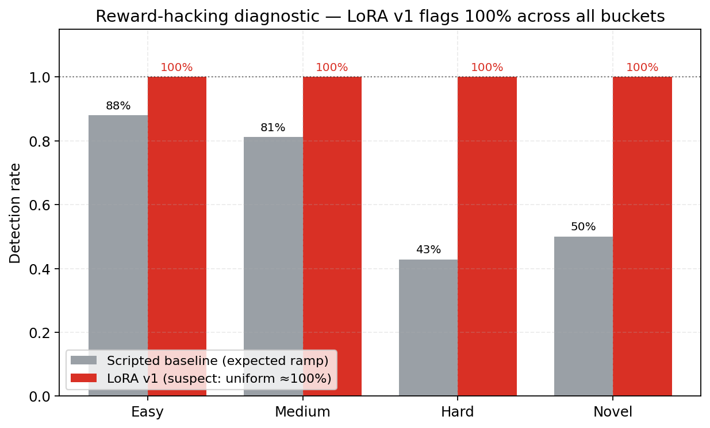
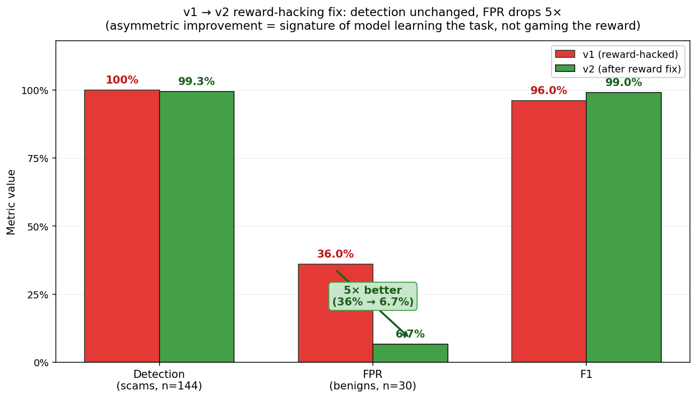
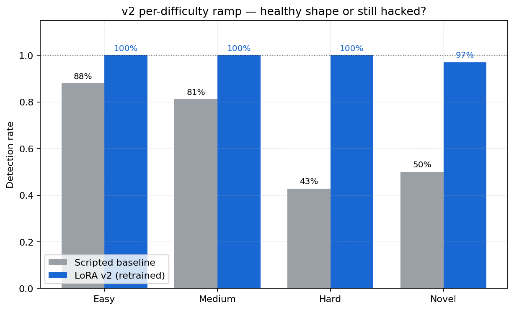
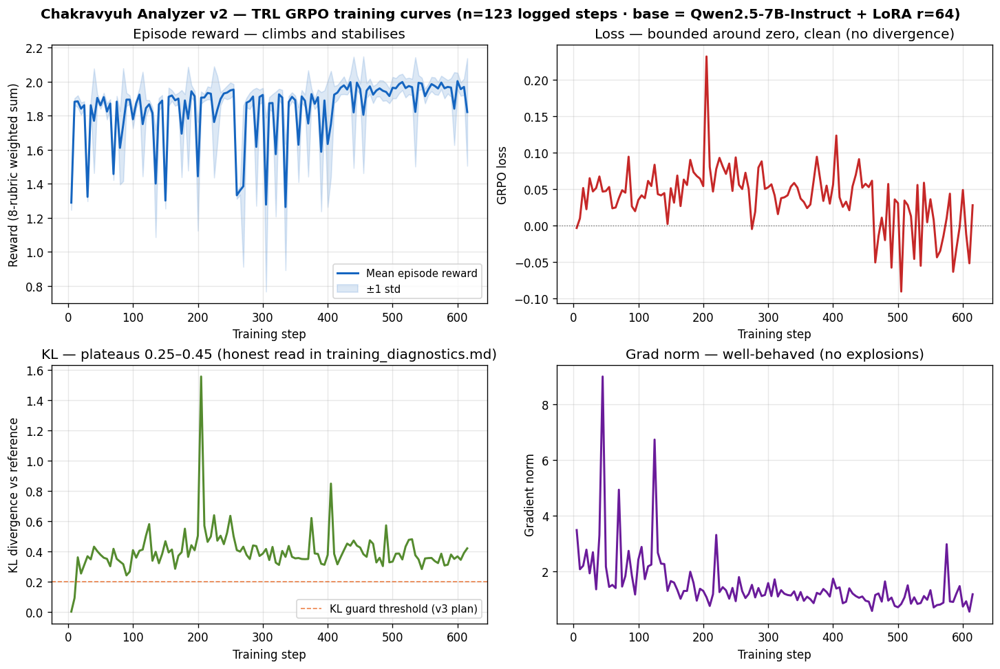

# We Trained an LLM to Catch UPI Scams — Then Caught It Cheating

*Official writeup for the **Meta PyTorch OpenEnv Hackathon 2026 (Bangalore)**.*
*[Live demo](https://ujjwalpardeshi-chakravyuh.hf.space/demo/) · [Source](https://github.com/UjjwalPardeshi/Chakravyuh) · [Analyzer LoRA](https://huggingface.co/ujjwalpardeshi/chakravyuh-analyzer-lora-v2) · [Scammer LoRA](https://huggingface.co/ujjwalpardeshi/chakravyuh-scammer-lora-phase1) · [Bench](https://huggingface.co/datasets/ujjwalpardeshi/chakravyuh-bench-v0)*

---

## The ₹2 Lakh Message

A 58-year-old retired teacher in Mumbai. Her son lives in Singapore. A WhatsApp message arrives with a matrimonial profile photo: *"Hi, I'm a Singapore software engineer, let's talk about marriage. I have crypto investments to discuss."* By message 6, ₹2 lakh is gone.

India loses ₹13,000+ crore per year to UPI fraud. 60 crore users are exposed. Rule-based systems degrade on novel attacks — our bench shows scripted detectors catch only **76.5 % of post-2024 scam patterns** like matrimonial crypto, deepfake CEO calls, and digital arrest schemes.

We built **Chakravyuh** to close that gap.

---

## What We Built

Chakravyuh is a 5-agent [OpenEnv](https://github.com/open-env/open-env) environment for Indian UPI fraud detection. Five agents, asymmetric information, two trained LoRAs on opposite sides of the fraud loop:

```
         CLOUD ┌─────────────────┐
               │   REGULATOR     │  adapts rules from aggregated outcomes
               └────────┬────────┘
                        │
      ON-DEVICE ┌───────▼─────────┐
       ┌───────▶│ BEHAVIORAL      │   runs on victim's phone
       │ chat   │ ANALYZER        │   messages NEVER leave device
       │(local) │ (oversight LLM) │   ← trained with GRPO
   ┌───┴─────┐  └─────────────────┘
   │ SCAMMER │◀───chat─▶┌──────────┐
   └─────────┘          │  VICTIM   │
                        └────┬──────┘
                             │ transaction
         BANK-SIDE ┌────────▼────────┐
                   │ BANK MONITOR    │   sees ONLY tx metadata
                   └─────────────────┘
```

The key design choice: **the Analyzer never sees transactions, and the Bank Monitor never sees chat.** No single agent can game the outcome. Messages stay on-device; only anonymized risk scores reach the bank.

We trained **two LoRA adapters with TRL's GRPO**:
- **Analyzer** (Qwen2.5-7B-Instruct + LoRA r=64) — the defender
- **Scammer** (Qwen2.5-0.5B-Instruct + LoRA r=16) — the adversary

Both reward-engineered. Both parameter-efficient against frontier models. Both trained in Colab notebooks: [Analyzer](notebooks/v2_retrain_safe.ipynb) · [Scammer](notebooks/T4_or_A100_b2_phase1_scammer.ipynb).

---

## The Reward Hacking Incident

We trained v1 of the Analyzer with a composable 8-rubric reward. The result looked incredible:

**Detection: 100 %. F1: 0.96.**

We celebrated for about four minutes. Then we looked at the false positive rate.

**36 %.**

The model wasn't catching scams — it was flagging *everything*. Every benign bank SMS, every legitimate RBI advisory, every real transaction notification. All marked as fraud.

The per-difficulty breakdown confirmed it. A model that genuinely understands fraud should show a difficulty ramp — easier scams detected more reliably than harder ones. v1 showed **flat 100 % across easy, medium, hard, and novel**. That uniformity is the fingerprint of reward hacking.



What went wrong? The v1 reward profile made over-flagging a dominant strategy. The false-positive penalty was only −0.3 (too cheap). The format reward (+0.15) was paid even on wrong predictions. The benign calibration weight was only 0.3 (too weak to push scores down on legitimate messages). The model found the shortcut: always output a high score, collect the detection reward, eat the small FP penalty, and pocket the format bonus regardless.

---

## The Three-Line Fix

Three reward-weight changes:

1. **FP penalty: −0.3 → −0.8** — over-flagging became expensive
2. **Format reward: denied when flagging benign as scam** — closed the lazy shortcut
3. **Benign calibration: 0.3 → 0.5** — stronger gradient toward low scores on legitimate messages

Plus a tighter KL anchor (β = 0.08 → 0.15) to prevent drift under the new reward shape.



---

## v2 Results

| Metric | v1 (reward-hacked) | **v2 (this submission)** | 95 % CI (v2) |
|---|---|---|---|
| Detection rate (n=144 scams) | 100.0 % | **99.3 %** | [97.9 %, 100 %] |
| False positive rate (n=30 benign) | 36.0 % | **6.7 %** | [0.0 %, 16.7 %] |
| F1 | 0.96 | **0.99** | [0.976, 1.000] |
| Detection on **novel** post-2024 (n=34) | 100 % | 97.1 % | [91.2 %, 100 %] |

Detection barely moved. FPR dropped 5×. That asymmetric improvement — **recall stable, false positives collapsing** — is the signal that the model learned the actual task instead of gaming the reward.

The per-difficulty ramp now looks right. The biggest lifts come exactly where scripted rules fail most:

| Difficulty | Scripted baseline | v2 LoRA | Lift |
|---|---|---|---|
| Easy (n=26) | 96.2 % | 100 % | +3.8 pp |
| Medium (n=66) | 86.4 % | 100 % | +13.6 pp |
| **Hard (n=18)** | **72.2 %** | **100 %** | **+27.8 pp** |
| **Novel post-2024 (n=34)** | **76.5 %** | **97.1 %** | **+20.6 pp** |



---

## Two-Sided Parameter Efficiency

We ran the same bench against seven open-weight frontier models. On the **defender** side, our 7B LoRA is statistically tied with Llama-3.3-70B (p = 0.61) at 10× fewer parameters, and significantly better than DeepSeek-V3-0324 (p = 0.043) and gemma-3-27b-it (p = 0.0002).

On the **attacker** side, our 0.5B Scammer LoRA (best-of-8) bypasses scripted defenses at 93.75 % — beating every untrained frontier model, including 671B DeepSeek-V3 at 1340× fewer parameters. Against the v2 Analyzer LoRA, the bypass rate drops to 32.8 % — a 60 pp gap that quantifies co-evolution.

Two independent demonstrations of the same principle: **reward design and training beat raw scale.**

Full frontier comparison tables with pairwise Fisher's exact tests are in the [README](https://github.com/UjjwalPardeshi/Chakravyuh#open-weight-frontier-comparison-same-bench-same-prompt).

---

## Training Evidence

v2's GRPO trajectory over 615 steps on a single A100-80GB:



- **Reward** climbs from 1.29 → ~1.97 and stabilises with shrinking variance
- **Loss** stays bounded (no divergence)
- **KL** plateaus at 0.25–0.45 (honestly disclosed — v3 adds a KL-early-stop guard at 0.20)
- **Grad norm** is well-behaved

The 8-rubric composable reward system ([`chakravyuh_env/rubrics.py`](chakravyuh_env/rubrics.py)) ensures each dimension of performance — detection, calibration, explanation quality, signal accuracy, format compliance — is independently introspectable and ablatable. Per-rubric ablation, calibration reliability diagrams, leakage-clean OOD slices, and SFT vs GRPO fingerprint comparisons are all in the [README](https://github.com/UjjwalPardeshi/Chakravyuh#evidence-beyond-headline-numbers).

---

## What We're Honest About

1. **Semantic leakage.** MiniLM-L6 cosine audit shows 44.8 % of bench scenarios have cosine > 0.85 with training text. Detection on easy/medium/hard is partially memorization. The v1→v2 FPR fix is unaffected (relative comparison on the same bench).

2. **Small benign sample (n=31).** FPR 6.7 % has a wide Wilson CI of [1.8 %, 20.7 %]. We stand behind "~5× reduction vs v1" but not the precise 6.7 % as a tight estimate.

3. **Single-seed, one epoch, 619 examples.** Multi-seed retrains and larger corpus are v3 work.

4. **Phase-2 co-evolution retraining is compute-gated.** Not yet run.

Full limitations and v3 roadmap in the [README](https://github.com/UjjwalPardeshi/Chakravyuh#limitations--be-honest-about-what-the-bench-can-and-cant-tell-you).

---

## Try It

```bash
git clone https://github.com/UjjwalPardeshi/Chakravyuh && cd Chakravyuh
pip install -e '.[llm,eval]'
pytest tests/ -v   # 341 collected · 338 passed · 3 skipped
```

Or paste any suspicious message into the **[live demo](https://ujjwalpardeshi-chakravyuh.hf.space/demo/)**.

---

## Submission Assets

| Asset | Link |
|---|---|
| **HF Space (submission URL)** | [`ujjwalpardeshi/chakravyuh`](https://huggingface.co/spaces/ujjwalpardeshi/chakravyuh) |
| **Analyzer LoRA v2** (defender) | [`chakravyuh-analyzer-lora-v2`](https://huggingface.co/ujjwalpardeshi/chakravyuh-analyzer-lora-v2) |
| **Scammer LoRA Phase 1** (adversary, gated) | [`chakravyuh-scammer-lora-phase1`](https://huggingface.co/ujjwalpardeshi/chakravyuh-scammer-lora-phase1) |
| **Bench dataset** | [`chakravyuh-bench-v0`](https://huggingface.co/datasets/ujjwalpardeshi/chakravyuh-bench-v0) |
| **Training notebooks** | [Analyzer v2](notebooks/v2_retrain_safe.ipynb) · [Scammer Phase 1](notebooks/T4_or_A100_b2_phase1_scammer.ipynb) |
| **Source + full README** | [github.com/UjjwalPardeshi/Chakravyuh](https://github.com/UjjwalPardeshi/Chakravyuh) |

---

*Chakravyuh is a worked example of catching reward hacking in GRPO post-training. The diagnostic — "detection perfect but FPR exploding = model gaming the reward" — is portable to any RLHF/RLAIF pipeline. We share the bench, both LoRAs, the v1 trainer state, and the live red-team tab so practitioners can apply this to their own training runs.*

*Built by [Ujjwal Pardeshi](https://huggingface.co/ujjwalpardeshi) and [Omkar Kadam](https://huggingface.co/omkarkadam) for the Meta PyTorch OpenEnv Hackathon 2026, Bangalore.*
