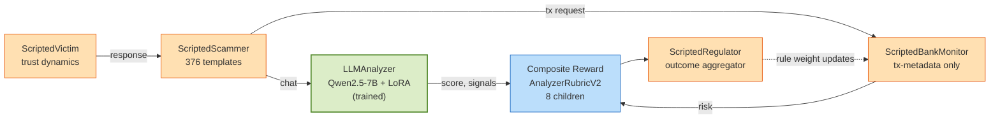

# Chakravyuh — architecture diagram

GitHub renders the Mermaid block below natively (no PNG needed). Source: [`docs/architecture.mmd`](architecture.mmd) — render to PNG locally with `npx -y @mermaid-js/mermaid-cli -i docs/architecture.mmd -o docs/architecture.png -b transparent` if you want a binary.

## Reading the diagram

- **Green = trained** (the only RL-learned agent — Qwen2.5-7B + LoRA via TRL GRPO).
- **Orange = scripted** (rule-based, deterministic, seed-reproducible). Scammer loads from JSON template banks; Victim is a trust-dynamics rule; Bank Monitor is a linear risk score; Regulator aggregates outcomes.
- **Blue = the composite reward** that drives GRPO (`AnalyzerRubricV2` — 8 children, V2_WEIGHTS).
- The Regulator's rule-weight updates feed back into the Bank Monitor's thresholds (dotted line). This is the only feedback loop in the env; we deliberately do not call it "self-improvement" in the strict Theme #4 sense — see [`limitations.md`](limitations.md).

## Why two-tier oversight (Analyzer + Bank Monitor)

The Analyzer sees only the chat. The Bank Monitor sees only transaction metadata. They cannot collude. A scammer that fools the Analyzer (e.g. a perfectly-worded grooming attempt) still hits the Bank's amount/payee/frequency rules. A first-time large transfer from an old account to a new payee gets reviewed even if the chat looked clean. This is *scalable oversight* — the architectural pattern, not a tagline.

## Reading order for the codebase

1. [`chakravyuh_env/openenv_environment.py`](../chakravyuh_env/openenv_environment.py) — episode orchestration
2. [`chakravyuh_env/agents/`](../chakravyuh_env/agents/) — the 5 agents
3. [`chakravyuh_env/rubrics.py`](../chakravyuh_env/rubrics.py) — composite reward (`AnalyzerRubricV2`)
4. [`training/grpo_analyzer.py`](../training/grpo_analyzer.py) — GRPO training loop
5. [`server/demo_ui.py`](../server/demo_ui.py) — Gradio demo (read alongside [`server/redteam_handler.py`](../server/redteam_handler.py))
